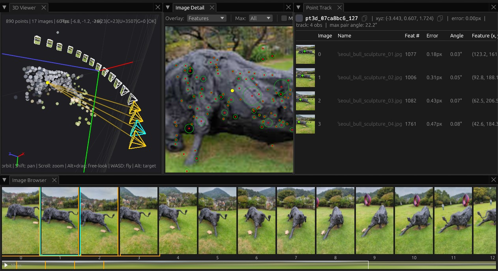

# The Structure from Motion Tool

## About this Project

The goal of this project is to make creating and exploring Structure from Motion (SfM) fun.
I had a bunch of vacation datasets of interesting scenes sitting around, ready for photogrammetry and
Gaussian splats, but using existing tools wasn't as fun as I imagined it could be. I
also wanted a project to cut my teeth on agentic AI coding tools with no expectations
or restrictions. The result is this project, and I hope you enjoy it if you give it a try!

SfM Tool builds heavily on the work of others, especially [COLMAP](https://colmap.github.io/)
and [OpenCV](https://opencv.org/). Most of what's different is around the workflow you use
to create SfM reconstructions.

### The SfM Explorer GUI

Once you have an .sfmr file, you can load it into the SfM Explorer GUI to view it in 3D.
In this screenshot, we've loaded the solution created by the below `sfm solve` command.
By selecting a 3D point, we can view the track it comes from and visualize all the projected
rays from the cameras.



### The `sfm` CLI command

The CLI command `sfm` is the interface for creating and evaluating reconstructions.
Every reconstruction must be performed within an SfM workspace. This opinionated approach
makes it easier and more predictable to use the command, and means you don't need to
repeat options redundantly while using it.

Here's the simplest way to create a workspace and perform an SfM reconstruction with
a small image dataset.

```
# Create the workspace and an images directory inside of it
$ mkdir -p workspace/images

# Copy the images into the workspace
$ cp /path/to/images/*.jpg workspace/images/

# Enter the workspace
$ cd workspace

# Initialize the workspace
$ sfm ws init .
Initialized workspace: .../workspace
Configuration file: .../workspace/.sfm-workspace.json
  feature_tool: colmap
  estimate_affine_shape: False
  domain_size_pooling: False
  max_num_features: None

# Solve SfM for the specified images using the global GLOMAP solver
$ sfm solve -g images/
Running global SfM with GLOMAP...
Image files:
  .../workspace/images/seoul_bull_sculpture_%02d.jpg (17 files, sequence 1-17)
...
Saved reconstruction to: .../workspace/sfmr/20260404-00-solve-seoul_bull_sculpture_1-17.sfmr
```

Now you can use a variety of commands to inspect the reconstruction.

```
# Overview of the reconstruction
$ sfm inspect sfmr/20260404-00-solve-seoul_bull_sculpture_1-17.sfmr
...

# Per-image reprojection error metrics
$ sfm inspect --metrics sfmr/20260404-00-solve-seoul_bull_sculpture_1-17.sfmr
...
```

## What is Structure from Motion?

In SfM, you start with a scene that is static and take photographs
of the scene from multiple different poses. Importantly, the poses should be in different
positions around the scene, not looking around from one position. Starting from just
the photographs, it solves for the structure of the scene and the camera poses at the same
time. The structure describes 3D points on surfaces that are visible from more than one
camera, and the motion describes camera intrinsics like focal length and lens distortion and
camera extrinsics like the image's position and orientation.

Recent research is focused on ideas like using feedforward networks to go straight from images
into 3D representations. This project is not about VGGT or similar techniques, but visualizing their
output in SfM tool or using them as part of SfM would be interesting to explore.

## Installation

Coming soon...

## About Me

I'm Mark Wiebe, and I've long had a soft spot for everything to do with capturing, reconstructing,
and rendering 3D. This is a personal project, all views are my own and do not reflect Amazon's
views or positions. I work as a Principal Engineer at AWS on the [Deadline Cloud](https://aws.amazon.com/deadline-cloud/)
web service that provides render farm/batch computing focused on rendering and related workloads.
Other projects I've helped create include the [conda package management system](https://conda.org/)
while building the [Anaconda Distribution](https://www.anaconda.com/download), introducing the
[EinSum](https://numpy.org/doc/2.2/reference/generated/numpy.einsum.html) function to NumPy, and
I played a major role creating tools at [Frantic Films](https://en.wikipedia.org/wiki/Frantic_Films)
and at [Thinkbox Software](https://aws.amazon.com/media-services/thinkbox/) (later acquired by AWS) such as
Deadline, Flood, Krakatoa, XMesh, Frost, Sequoia and more.