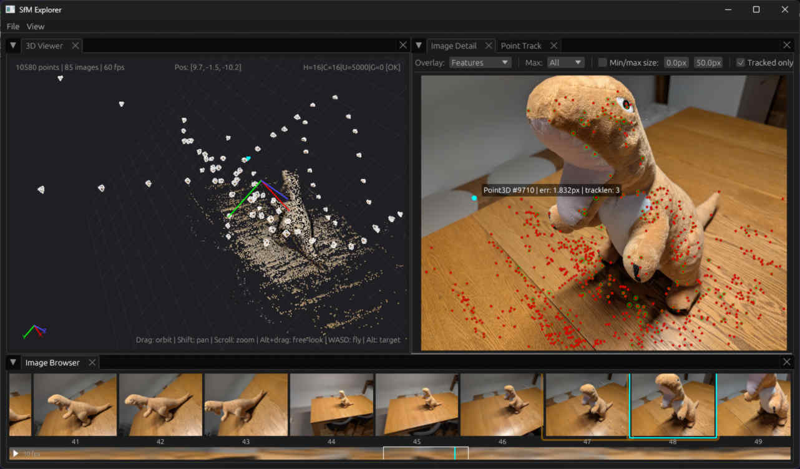
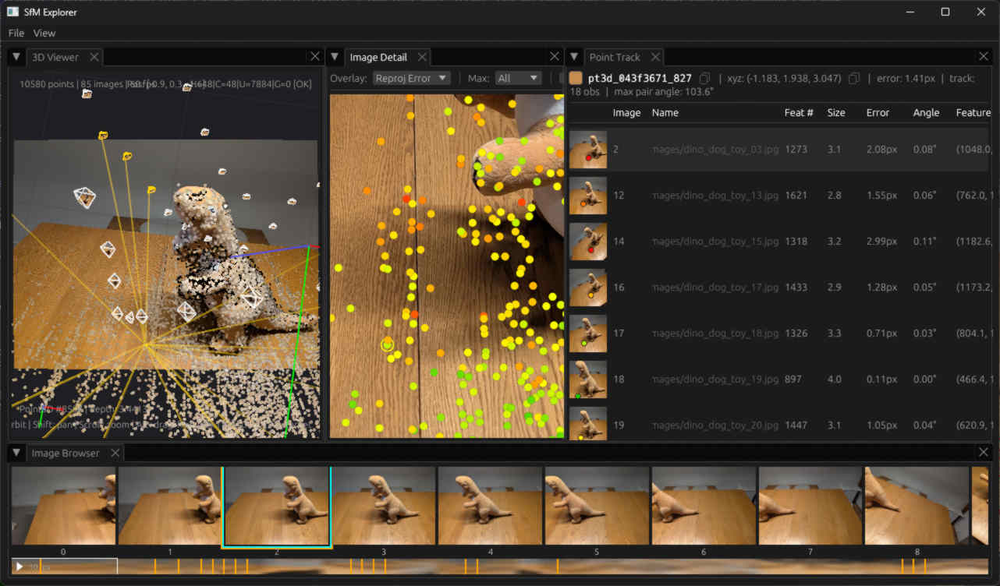
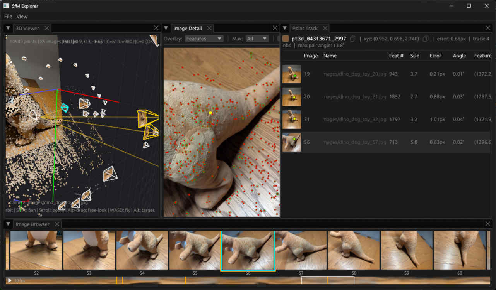
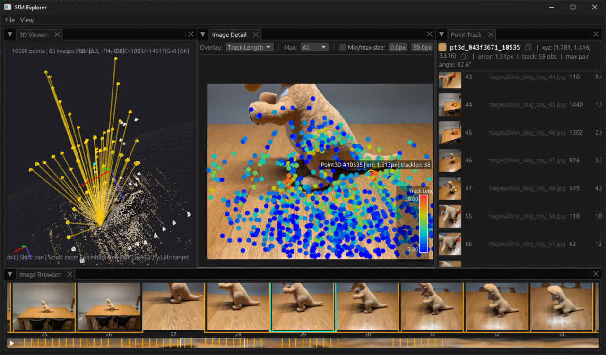
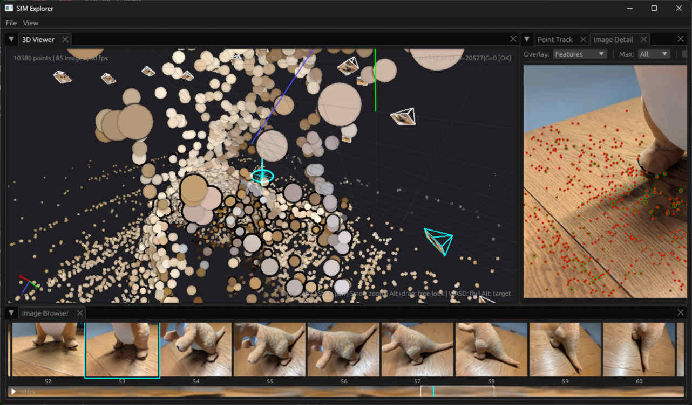

# Getting Started

## Quickstart

With a good set of photographs, use SfM Tool to create and view a sparse
reconstruction in a few steps. This uses COLMAP and GLOMAP under the hood.

We'll use the [dino dog toy dataset](https://github.com/sfmtool/sfmtool/tree/main/test-data/images/dino_dog_toy)
— 85 photographs of a dog toy taken from different angles. The table and the
toy have texture detail that gives a rich set of SIFT features for the solve.

### 1. Install and set up

```
$ pip install sfmtool
```

Create a workspace directory and copy your images into it.

```
$ mkdir -p dino/images
$ cp path/to/dino_dog_toy/*.jpg dino/images/
$ cd dino
```

### 2. Initialize the workspace

```
$ sfm init --max-features 4000
Initialized workspace: .../dino
Configuration file: .../dino/.sfm-workspace.json
  feature_tool: colmap
  estimate_affine_shape: False
  domain_size_pooling: False
  max_num_features: 4000
```

### 3. Solve

Run the global SfM solver (GLOMAP). This automatically extracts SIFT features,
matches them across images, and solves for camera poses and 3D structure.

```
$ sfm solve -g images/ --max-features 2000
Running global SfM with GLOMAP...
Image files:
  .../dino/images/dino_dog_toy_%02d.jpg (85 files, sequence 1-85)
...
Found reconstruction 0:
  Cameras: 1, Images: 85, Points: 10580
Saved reconstruction to: .../dino/sfmr/20260413-00-solve-dino_dog_toy_1-85.sfmr
Completed in 1m 4.75s
```

### 4. Explore in 3D

Launch the SfM Explorer GUI and open the `.sfmr` file from the `sfmr/`
directory.

```
$ sfm explorer
```

!!! note
    The `sfm explorer` command is not yet included in the PyPI package. To run
    it from source, use `pixi run gui`. SfM Explorer has only been tested on
    Windows.



## Viewing 3D Point Tracks

A point track connects a 3D point to its 2D observations across multiple
images. Exploring tracks is a great way to understand how SfM links features
across photographs.

### 1. Set up the layout

Arrange SfM Explorer so that the **Image Detail** and **Point Track** panels
are visible side by side.



In this screenshot, I've also double-clicked on the third image to set the 3D
viewport, selected a feature in the Image Detail panel, and changed the Image
Detail panel to view the reprojection error as a heat map. The feature is part
of a track with 18 observations, and the table shows the SIFT feature sizes and
reprojection error in both pixels and degrees.

### 2. Navigate the 3D viewport

The 3D viewport is in camera view mode. Use the mouse or trackpad to look
around freely, and hold Control to zoom the field of view in and out. You can
click on image frustums to select them, which will show them in the Image
Detail panel, and you can click on 3D points to select them and show their
tracks. Here, I've looked over to the right, selected a 3D point, then
selected one of the cameras in its track.



### 3. Free navigation

Hold Shift and drag the mouse (or use the trackpad gesture) to exit the camera
view and pan freely in 3D. Now the mouse or trackpad will orbit around a
target. You can also use keyboard controls to fly through the scene:

- **A / D** — fly left / right
- **W / S** — fly forward / back
- **R / F** — fly up / down
- **Q / E** — tilt left / right



In this screenshot, the Image Detail now shows the track length heat map, and
I picked out a feature that's part of a long track with 58 observations. If
you're comfortable in 3D video games, it should be easy to move the viewport to
get a good view of all the track projection rays as I have done.

### 4. Manipulate the target

Hold Alt and drag the mouse (or use the trackpad gesture) to make the target
visible. Instead of orbiting, the drag will now look around freely from a
stationary point. You can double-tap Alt to toggle the target visibility and
see its position and orientation while you navigate the scene.



The orbiting behavior is affected by the target, which shows the ground plane
as a "compass" and a vertical line showing the up/down direction. If you look
at the compass edge-on, you can use the Q and E keys to rotate the target, and
get it aligned with any ground plane in your SfM solution. This will make
orbiting around it more comfortable.

## Inspecting a Reconstruction

### 1. Reconstruction summary

Use `sfm inspect` to get a detailed summary of a reconstruction from the
command line. Even from the command line, you can get an idea about the 3D
points from this output. The bounding box extents are accompanied by histograms
that show the point density projected to each axis. Similarly, you can see a
histogram of the reprojection error, track lengths, and 3D distance to the
nearest other point.

```
$ sfm inspect sfmr/20260413-00-solve-dino_dog_toy_1-85.sfmr

Reconstruction file: 20260413-00-solve-dino_dog_toy_1-85.sfmr
======================================================================

Metadata:
  Operation: sfm_solve
  Tool: glomap
  Tool version: unknown
  Timestamp: 2026-04-13T20:35:01.368085-07:00

Workspace:
  Absolute path: C:\Dev\dino-test
  Relative path: ..
  Resolved workspace: C:\Dev\dino-test
  Feature tool: unknown

Reconstruction summary:
  Images: 85
  Image paths:
    images\dino_dog_toy_%02d.jpg (85 files, sequence 1-85)
  Cameras: 1
  3D points: 10580
  Observations: 80387
  Avg observations per point: 7.60

Cameras:
  Camera 0: SIMPLE_RADIAL 2040x1536
    Parameter                      Value
    --------------------  --------------
    focal_length             1472.560231
    principal_point_x        1020.000000
    principal_point_y         768.000000
    radial_distortion_k1        0.021340

Rig configuration: none

3D Point statistics:
  Position range:
    X: [-14.750, 31.935]
    X distribution:
      ▁    ▁ ▁    ▁▁▁▁▁▁▂▅█▆▄▂▁▁▁▁▁▁▁▁▁▁▁▁▁▁  ▁▁▁▁              ▁    ▁
      -14.750                                                   31.935
    Y: [-6.598, 15.843]
    Y distribution:
      ▁  ▁▁▁  ▁▁▁▁▁▁▁▁▁▂▃▆█▆▄▅▇▇▅▁▁▁▁▁▁           ▁         ▁▁▁ ▁ ▁▁▁▁
      -6.598                                                    15.843
    Z: [-7.850, 14.627]
    Z distribution:
      ▁    ▁▁ ▁▁▁▁▁▁         ▁▁▁▁▂▆█▇▅▃▂▃▃▂▁▁▁▁▁      ▁▁▁▁▁▁▁▁▁▁▁▁▁▁ ▁
      -7.850                                                    14.627
  Reprojection error:
    Mean: 1.165 pixels
    Median: 1.152 pixels
    Min: 0.045 pixels
    Max: 3.912 pixels
    Error distribution:
      ▁▁▁▁▁▂▂▃▃▄▅▄▆▆▆▇▇▇▇█▆▆▆▆▅▄▄▃▃▂▂▁▁▁▁▁▁▁▁▁▁▁▁▁▁▁▁▁▁▁▁▁▁  ▁   ▁  ▁▁
      0.045                                                      3.912

Observation statistics:
  Min observations per point: 2
  Max observations per point: 58
  Median observations per point: 5
    Track length distribution:
      ▁█▄▂▁▁▁ ▁▁▁▁▁▁▁ ▁▁▁▁▁▁▁ ▁▁▁▁▁▁▁ ▁▁▁▁▁▁▁ ▁▁▁▁▁▁▁ ▁▁▁▁▁▁▁ ▁▁▁ ▁▁ ▁
      2.000                                                     58.000

Nearest neighbor distances:
  Min: 0.000000
  Max: 5.487719
  Mean: 0.037203
  Median: 0.024898
    NN distance distribution:
      █▁▁▁▁▁▁▁▁▁▁ ▁▁      ▁      ▁     ▁             ▁               ▁
      0.000                                                      5.488

Completed in 0.04s
```

### 2. Image reprojection statistics

The `--metrics` flag shows per-image reprojection error statistics, sorted by
mean error descending. Each row includes a histogram of that image's error
distribution, plus the observation count, mean track length, and a flag for
images with elevated error.

```
$ sfm inspect --metrics sfmr/20260413-00-solve-dino_dog_toy_1-85.sfmr

Per-image metrics analysis for: 20260413-00-solve-dino_dog_toy_1-85.sfmr
====================================================================================================
Reconstruction: 85 images, 10,580 points, 80,387 observations
Mean reprojection error: 1.165 px (median: 1.152 px)
Flagged images: 1 elevated-error

Image (by mean error desc)                           Obs   MeanErr    MedErr    MaxErr  MeanTL  Flag
----------------------------------------------------------------------------------------------------
images/dino_dog_toy_15.jpg                          1176     1.764     1.593     4.312    17.8  !
      ▁▂▃▃▅▅▅▆▇▆▆▆▆▇▇█▇▅▆▅▂▅▄▃▃▃▄▂▄▂▂▁▁▃▂▂▂▁▁▁▁ ▁
images/dino_dog_toy_16.jpg                          1036     1.710     1.539     4.005    15.7
      ▁▁▂▄▄▅▅█▅▅▅▄▄▄▄▅▃▄▃▄▃▂▃▂▄▃▂▂▃▁▁▂▂▂▂▁▁▂▁▁
images/dino_dog_toy_43.jpg                          1076     1.692     1.572     4.161    17.0
      ▁▁▁▄▃▅▄█▅▄▄▄▃▄▂▃▃▃▄▄▃▃▃▃▂▂▂▂▂▂▂▁▁▁▁▁▁▁▁▁▁
images/dino_dog_toy_34.jpg                          1071     1.638     1.491     4.293    16.8
      ▁▂▄▆▆▆█▆▅▇▅▅▆▅▅▆▅▆▅▄▃▃▄▃▃▂▃▄▂▂▂▂▂▂▂▂▁▁▁   ▁
images/dino_dog_toy_44.jpg                           846     1.616     1.434     4.128    16.6
      ▁▁▂▃▄▅▅█▆▅▃▃▄▃▃▃▄▃▃▃▃▄▃▃▂▂▃▁▂▁▁▁▁▁▁▁▁▁▁▁▁
...
images/dino_dog_toy_26.jpg                           865     0.882     0.659     3.936    14.4
      ▁▄▆▇▇█▇▅▃▄▃▂▁▂▁▁▁▁▁▁▁▁▁▁▁▁▁▁▁▁▁▁▁ ▁▁▁▁▁
images/dino_dog_toy_25.jpg                          1056     0.878     0.691     3.879    14.3
      ▁▅▆▆█▇▆▅▆▄▃▂▂▁▁▁▁▁▁▁▁▁▁▁▁▁▁▁▁▁▁▁▁▁▁▁▁▁▁
----------------------------------------------------------------------------------------------------
      0                                              5.1 px
!!  mean error > 2.305 px (2x reconstruction median of 1.152 px)
!   mean error > 1.729 px (1.5x reconstruction median of 1.152 px)
--  no observations (image registered but no points)
MeanTL = mean track length (avg number of images observing each point)

Completed in 0.10s
```

### 3. Depth range per image

The `--z-range` flag shows the range of 3D point depths as seen from each
camera, with a histogram of the depth distribution.

```
$ sfm inspect --z-range sfmr/20260413-00-solve-dino_dog_toy_1-85.sfmr

Z range statistics for: 20260413-00-solve-dino_dog_toy_1-85.sfmr
======================================================================
Images: 85
3D points: 10580
Histogram buckets: 128

Summary statistics:
  Images with data: 85/85
  Min Z range: [0.738, 9.019]
  Max Z range: [1.873, 36.001]
  Observed points per image: [103, 1672]

Per-image Z ranges:
  images/dino_dog_toy_01.jpg:
    Z range: [4.250, 15.881]
    Observed:  n= 851, med=5.486, mean=5.878
               [▁▄▅▆▅█▇▄▃▃▂▂▂▂▁▂▂▁▁▁▁▁▁▁▁             ▁   ▁    ▁▁▁ ▁▁▁ ▁       ▁]
  images/dino_dog_toy_02.jpg:
    Z range: [3.864, 14.936]
    Observed:  n=1264, med=4.838, mean=5.103
               [▃▁▂▆█▆▄▄▃▁▁▁▁▁▁▁▁▁▁▁▁▁▁▁▁▁▁▁                       ▁▁ ▁ ▁      ▁]
  images/dino_dog_toy_03.jpg:
    Z range: [3.846, 14.450]
    Observed:  n=1540, med=4.771, mean=4.992
               [▂▁▂▆█▆▄▄▃▂▂▁▁▁▁▁▁▁▁▁▁▁▁▁▁▁▁ ▁▁                         ▁▁▁▁▁  ▁▁]
  images/dino_dog_toy_04.jpg:
    Z range: [3.822, 14.340]
    Observed:  n=1672, med=4.767, mean=5.019
               [▂▁▂▇▆█▄▃▃▂▂▁▁▁▁▁▁▁▁▁▁▁▁▁▁▁▁▁▁▁                        ▁▁▁▁▁▁ ▁ ▁]
  images/dino_dog_toy_05.jpg:
    Z range: [3.850, 13.771]
    Observed:  n=1439, med=4.763, mean=5.010
               [▃▁▂▆▇█▅▄▄▂▂▂▁▁▁▁▁▁▁▁ ▁▁▁▁ ▁▁ ▁▁                     ▁▁▁▁ ▁▁▁▁▁▁▁]
  ...
  images/dino_dog_toy_84.jpg:
    Z range: [0.974, 2.033]
    Observed:  n= 182, med=1.275, mean=1.363
               [▁▁▁▁▂▁▁▂▁▁▂▂▄▃▄▅▄█▃▂▁▂▂▁▃▁ ▄▁▁▁▁▁ ▁▁ ▁▂ ▂ ▁ ▁▁▁▁ ▁▁▁▁ ▁  ▁▂▁▁  ▁]
  images/dino_dog_toy_85.jpg:
    Z range: [1.091, 1.873]
    Observed:  n= 138, med=1.328, mean=1.388
               [▂▁ ▂▅ ▂▁▃▅▃▃▄▄▄██▇▆▅▁▄▃▂▁▁▃▂▅▂▁ ▄▁ ▂▂▂▁▂▂▄    ▂▄▄▁ ▁▂▃ ▁  ▁    ▁]

Completed in 0.04s
```

### 4. Detect sequence discontinuities

The `sfm discontinuity` command analyzes successive camera motions in image
sequences and flags jumps in translation or rotation. This is especially useful
for reconstructions made from video footage, where a discontinuity can indicate
a problem with the solve.

```
$ sfm discontinuity sfmr/20260413-00-solve-dino_dog_toy_1-85.sfmr
Reconstruction: 85 images, 10,580 points, 80,387 observations
Found 1 sequence(s)

Analyzing sequence: images\dino_dog_toy_%02d.jpg (85 frames)

  Successive motion -- median translation: 0.8931, median rotation: 10.06°
  Extrapolation thresholds:  trans>2.6794 (3x median step)  rot>15.0° (fixed)

    Frame  Image                                     L.trans   L.rot  R.trans   R.rot  Flag
  -----------------------------------------------------------------------------------------------
        1  images/dino_dog_toy_01.jpg                      -       -   0.3631   2.15°
        2  images/dino_dog_toy_02.jpg                      -       -   0.2910   3.86°
        3  images/dino_dog_toy_03.jpg                 0.3631   2.15°   0.1158   2.31°
        4  images/dino_dog_toy_04.jpg                 0.2910   3.86°   0.1039   1.34°
        5  images/dino_dog_toy_05.jpg                 0.1158   2.31°   0.0841   1.66°
        ...
       83  images/dino_dog_toy_83.jpg                 0.1783   3.92°   0.2595   5.16°
       84  images/dino_dog_toy_84.jpg                 0.3085   5.90°        -       -
       85  images/dino_dog_toy_85.jpg                 0.2595   4.88°        -       -

================================================================================
Summary
================================================================================

  images\dino_dog_toy: 85 frames, 10 discontinuity(s)
              Edge  Dist(prev)      Dist  Dist(next)      Rot   SharedPts    Err(A)    Err(B)
    -------------------------------------------------------------------------------------------------
              8->9      0.7198     0.4371       0.9174   <23.60°>         637   1.259px   1.600px
            11->12      1.2370     0.8553       0.6491   <11.66°>         871   1.202px   0.986px
            16->17      0.8221     0.1831       1.8127   <30.90°>         623   1.710px   1.230px
            27->28      0.4765    <9.1148>      0.6144     6.60°          121   1.388px   1.389px
            37->38      0.6539    <4.5843>      0.9920   <63.77°>          44   1.429px   1.190px
            44->45      0.9375    <9.5281>      2.3214   <54.10°>          83   1.616px   1.188px
            53->54      0.7773     1.1221       1.1162   <24.71°>          74   1.030px   1.312px
            56->57      0.7577     0.7312       0.6561   <11.42°>         414   1.306px   1.455px
            64->65      0.6032     0.7401       1.0490   <21.51°>         354   1.146px   1.228px
            70->71      1.3146     1.0790       1.2156   <10.70°>         382   1.349px   1.366px

Total: 10 discontinuity(s) across 1 sequence(s).
Completed in 0.10s
```

This dataset isn't from video — the images were taken from different angles
around the toy — so the detected discontinuities here are expected large
changes in viewpoint rather than actual problems.
